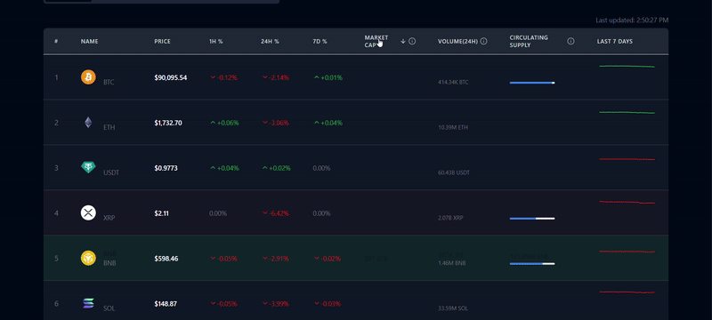
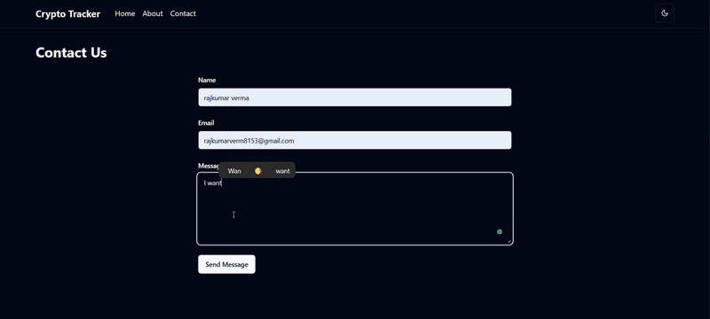
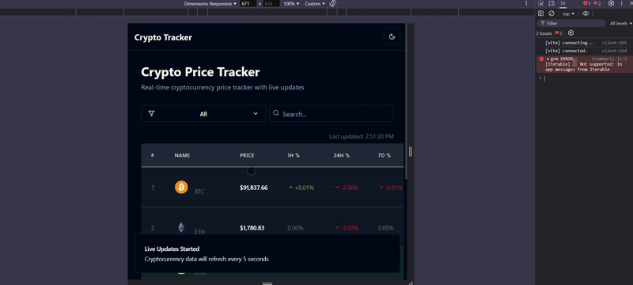

# 💹 Real-Time Crypto Tracker

A responsive, real-time cryptocurrency tracking application built using **React**, **Redux Toolkit**, and **Vite**. Inspired by platforms like CoinMarketCap, this app simulates real-time updates via mocked WebSocket logic and manages all global state using Redux.

---

## 📽️ Demo

  

  
---

## 🛠️ Features

- ⚡ Real-time simulation of crypto price updates using `setInterval`
- 📊 Table UI with dynamic values for:
  - Price
  - % Change (1h, 24h, 7d) — with green/red coloring
  - Market Cap, Volume, Circulating/Max Supply
  - Static 7D SVG chart
- 🎨 Responsive design using **Tailwind CSS**
- 🧠 Fully powered by **Redux Toolkit** (no local state)
- 🔎 Performance optimized with Redux selectors

---

## 🧱 Tech Stack

| Tech               | Purpose                        |
|--------------------|--------------------------------|
| React              | UI library                     |
| Redux Toolkit      | State management               |
| Vite               | Development environment        |
| Tailwind CSS       | Utility-first styling          |
| Recharts           | Static chart visuals (7D)      |
| TypeScript         | Type safety                    |

---

## 🧩 Architecture

```plaintext
src/
├── assets/               # Logos & static charts
├── components/           # Table, Chart, Cell, etc.
├── features/
│   └── crypto/           # Redux slice, selectors
├── mocks/                # Mock WebSocket simulation
├── App.tsx
├── main.tsx
└── store.ts              # Redux store config
```
## Run Locally in our machine
```
git clone https://github.com/Princeraj82/Cryptowebapp.git
```
```
cd Cryptowebapp
```
```
npm install
````
```
npm run dev
```
```
npm run build
```
```
npm run preview
```

Thanks for visiting my Repo.
